<table style="width:100%;">
<colgroup>
<col style="width: 27%" />
<col style="width: 28%" />
<col style="width: 16%" />
<col style="width: 27%" />
</colgroup>
<tbody>
<tr>
<td>Team Member’s Last Name</td>
<td>Team Member’s First Name</td>
<td>ID</td>
<td>Streamlit Result Alias</td>
</tr>
<tr>
<td>Htun</td>
<td>Nyan Paing</td>
<td>13053107</td>
<td>Booking</td>
</tr>
<tr>
<td>Patil</td>
<td>Monali</td>
<td>14370946</td>
<td>Flight Center</td>
</tr>
<tr>
<td>Yaputra</td>
<td>Michael</td>
<td>24619001</td>
<td>Expedia</td>
</tr>
<tr>
<td>Vanderbilt</td>
<td>Charles</td>
<td>11210325</td>
<td>Kayak</td>
</tr>
</tbody>
</table>

<table>
<colgroup>
<col style="width: 17%" />
<col style="width: 82%" />
</colgroup>
<tbody>
<tr>
<td>GitHub</td>
<td>Project Repo: <a
href="https://github.com/monalippatil/MachineLearning-Domestic-Flight-Fare-Prediction-Streamlit-Application.git">https://github.com/monalippatil/MachineLearning-Domestic-Flight-Fare-Prediction-Streamlit-Application.git</a></td>
</tr>
</tbody>
</table>

36120 - Advanced Machine Learning Application

Master of Data Science and Innovation

University of Technology of Sydney

Table of Contents

[**1. Executive Summary 2**](#executive-summary)

[**2. Business Understanding 3**](#business-understanding)

> [a. Business Use Cases 3](#_bnjfuh5ewogw)

[**3. Data Understanding 4**](#data-understanding)

[**4. Data Preparation 5**](#data-preparation)

[**5. Modeling 6**](#modeling)

> [a. Approach 1 6](#_uv8sn0ik6017)
>
> [b. Approach 2 6](#_wtwxuxemqtvc)
>
> [c. Approach 3 6](#_nrl8g3ri789x)

[**6. Evaluation 8**](#evaluation)

> [a. Evaluation Metrics 8](#_qx20m6hrk8uo)
>
> [b. Results and Analysis 8](#_25v57zsj5m7g)
>
> [c. Business Impact and Benefits 8](#_hkob76wu4d6q)
>
> [d. Data Privacy and Ethical Concerns 9](#_uf1z6gbsejg6)

[**7. Deployment 10**](#deployment)

[**8. Collaboration 11**](#collaboration)

> [a. Individual Contributions 11](#_5fycwkjr7bjp)
>
> [b. Group Dynamic 11](#_4tp33skt3su4)
>
> [c. Ways of Working Together 11](#_t9y1jnesjjm)
>
> [d. Issues Faced 12](#_oeeyog5w6nd)

[**9. Conclusion 13**](#conclusion)

[**10. References 14**](#references)

#  

# Executive Summary

This project aimed to develop a web-based application to estimate
airfare for local travel within the USA. The application was designed to
assist travelers, travel professionals, and budget-conscious individuals
in making informed decisions regarding their travel expenses. Through
the integration of multiple machine learning models, the application
provides users with fare predictions based on their travel details.

**Relevance and Goals:**

The relevance of this project lies in addressing the need for accurate
airfare estimation, which is a crucial aspect of travel planning.
Travelers often face challenges in budgeting their trips, while travel
professionals and businesses seek efficient ways to manage travel
expenses. The project's primary goals included:

1.  Developing a user-friendly web application for estimating airfare.

2.  Integrating multiple machine learning models to provide diverse fare
    predictions.

3.  Offering a UI tool that enhances user experience and decision-making
    in travel planning.

**Problem Statement:**

The problem at hand was to create an application that could take
user-input travel details, including departure and destination airports,
departure date and time, and cabin type, and provide accurate fare
estimates. This involved addressing challenges related to dynamic
pricing, data quality, and user expectations.

**Overall Context:**

In the travel industry, the ability to estimate airfare plays a pivotal
role in the success of travel plans. This project served as a response
to the dynamic and competitive nature of the travel sector, where
travelers and professionals alike seek tools to streamline the planning
process and optimize budgets. The application's outcome aimed to provide
a valuable solution for users to better plan their trips, whether for
personal travel, business purposes, or cost-conscious exploration. It
strived to enhance user satisfaction, offer more accurate fare
estimates, and contribute to the travel and transportation industry's
innovation.

# Business Understanding

Covid-19 has caused an unprecedented drop in demand for air
transportation in 2020 and airlines had no choice but to downsize their
fleet and manage resources to stay afloat. Starting in 2022, the airline
industry has been experiencing a significant rebound from the pandemic
level but airline companies have yet to keep up. Figures from the first
half of 2023 shows the population are eager to fly despite the rising
cost of living and global economic slowdown (ING, 2023).

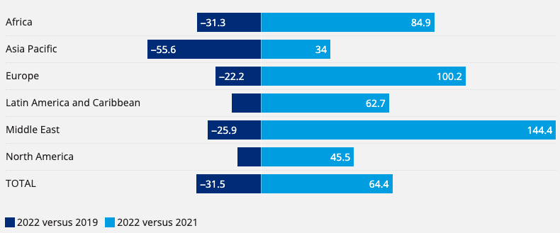**Figure 1:** Worldwide air
passenger demand (Stalnaker et al, 2023)

Rising demand and limited supply has put pressure on ticket prices and
flying has become more expensive. In the US, ticket fares in May 2023
were 30% more expensive compared to January 2022.

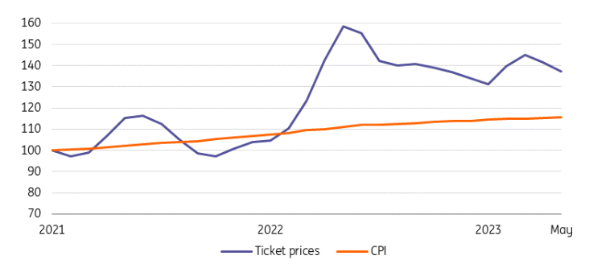

**Figure 2:** Index ticket price vs consumer price index in the US (ING,
2023)

With air transportation demand soaring, fares are through the roof and
rising cost of living. It can be beneficial for organizations or
governments to develop a web application to help consumers estimate
airfares and better plan and manage their spendings on necessities and
leisures.

## **Web Application**

In this project, we will develop a web application for estimating local
travel airfare which can be applied to various business use cases and
scenarios in the travel and transportation industry, including:

**1. Travel Planning Websites and Apps:**

-   Travel planning websites and mobile apps can integrate the airfare
    estimation feature to help users plan and budget their trips more
    effectively.

-   Users can estimate airfare costs when browsing for potential
    destinations and itineraries.

**2. Travel Agencies and Tour Operators:**

-   Travel agencies and tour operators can use the application to
    provide quick fare estimates to clients when designing customized
    travel packages.

-   The tool can help travel professionals offer more accurate pricing
    information.

**3. Travel Deal Aggregators:**

-   Travel deal aggregators can integrate airfare estimation to enhance
    their deal listings.

-   Users can see estimated total costs, including airfare, when
    browsing for travel deals.

**4. Hotel and Accommodation Booking Sites:**

-   Hotel and accommodation booking sites can expand their services by
    providing airfare estimates along with room booking options.

-   Users can get a comprehensive view of trip costs.

## **Challenges**

With different variables to consider, such as direct/indirect flights,
budget/premium seats and multiple airline companies, estimating ticket
fares can be challenging, including:

-   **Dynamic Pricing:** Airlines use dynamic pricing strategies, which
    can make fare prediction challenging as prices change frequently
    based on demand, time, and other factors.

-   **Data Quality:** Ensuring the accuracy and completeness of the
    historical airfare data used for training the models is a challenge.

-   **Competition:** The travel industry is highly competitive, and
    providing accurate fare estimates can be a differentiator.

The web application has the potential to address the challenges in the
travel industry by providing a valuable tool for users to estimate
airfare costs. It facilitates better decision-making, and opens doors to
potential revenue streams for businesses in the travel and
transportation sector.

# Data Understanding

The dataset used for the project is a collection of purchasable flight
tickets between April and July 2022, specifically for travel to and from
various airports within the USA. It provides information on airfares,
travel details, and flight characteristics.

## **Data Sources and Limitations**

While the specific source is not mentioned, it is assumed to be a
publicly available dataset for research and analysis. The limitations of
the dataset includes the following:

1.  **Temporal Limitation:** The dataset covers a specific time frame
    between April and July 2022, which may not be representative of
    airfare dynamics throughout the year.

2.  **Scope**: The dataset focuses on travel within the USA and includes
    a limited set of airports. This may not be suitable for estimating
    international travel costs.

3.  **Data Completeness:** Data quality and completeness can be a
    limitation. Handling missing values and ensuring data accuracy are
    crucial steps in data preprocessing.

## **Total Rows and Columns**

There are 13,519,999 rows and 23 columns in the dataset

## **Columns**

Available columns include flight dates, departure/arrival airports,
direct/indirect flights and search dates

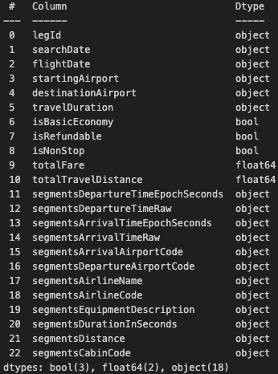

## **Number of Unique Flights**

In total there are only 1,721,518 unique flights, majority are
duplicates due to multiple searches

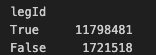

## **Cabin Options**

There are 4 cabin options to choose from: coach, premium coach, business
and first

## **Search date range**

Search date ranges from April 2022 to May 2022

## **Non-stop Flights**

Majority of flights are indirect flights but we would need to remove
duplicates first in order to verify this information

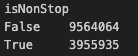

## **Flight Fares**

Majority of the fares are between $1 and $1,000

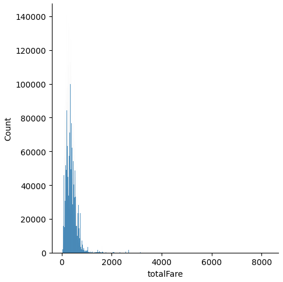

## **Total Searches Based on Flight Dates**

Number of searches peaked for May and June flights, this could be due to
summer holiday season in the US

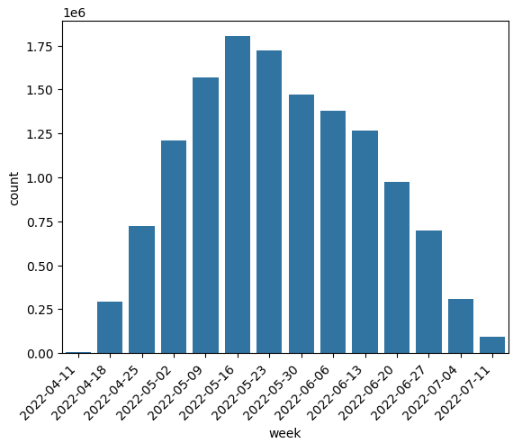

## **Flight Fares Variation Between Dates**

Average weekly price has been steady. Fares were high in early April
followed by a drop in early May and then stayed around $350-$400
throughout June and July

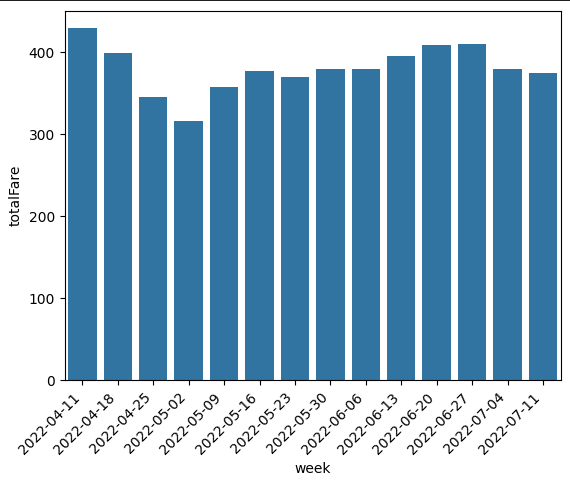

## **Number of Unique Pair of Departure and Arrival Airports**

There are 235 unique pairs of departure and arrival airports and all
flights departure and arrival pairs have direct and indirect flight
option

## **Maximum number of transits**

There are up to 4 transits per flight in the dataset

# Data Preparation

## **Data Cleaning**

**Missing Values**

There are no significant missing values in the dataset. But for the few
columns that are missing values, we will use imputation methods to fill
the gap, such as filling missing values with the mean for travel
distance.

**Duplicate Rows**

Duplicate rows were detected since there are multiple searches for the
same flight. Sometimes flight fare varies between searches for the same
flight. To deal with this, we will calculate the average fares for the
same flight.

## **Data Preprocessing**

**‘segmentsDepartureTimeRaw’ vs 'segmentsDepartureTimeEpochSeconds'**

Looks like 'segmentsDepartureTimeEpochSeconds' is based on UTC and
'segmentsDepartureTimeRaw' is based on departure airport timezone, which
should be the case in real life, passengers will book departure flights
based on departure airport timezone.

Also 'segmentsDepartureTimeRaw' looks more like scheduled departure time
whereas 'segmentsDepartureTimeEpochSeconds' looks like actual depart
time which is susceptible to changes due to delays

We will be using 'segmentsDepartureTimeRaw' instead of
'segmentsDepartureTimeEpochSeconds' to illustrate a real life scenario
by converting ‘segmentsDepartureTimeRaw’ into readable format.

**Data Type Downcasting**

To save memory and improve processing speed, data types of numerical
columns, objects columns, datetime columns were downcasted to their
appropriate types. For example, converting integer columns to smaller
integer types or using float32 instead of float64 for floating-point
columns. Objects columns to category data types etc.

**Feature Engineering**

Creating 'Average Flight Fare' as a new target to train the model. With
several variables such as number of transits and airline companies, it
is difficult to determine ticket fare accurately, we will be using the
average fares for the same flight and across airline companies as the
target variable.

To calculate the average flight fare, the dataset was first grouped by
'legId' and 'flightDate'. The 'totalFare' values within each group were
averaged to calculate the 'average flight fare' for each unique
combination of 'legId' and 'flightDate'. This new feature provides
insights into historical fare trends for specific flights on particular
dates with uniform transformation for the historical data. Our models
will be trained using this new feature as a target.

# Modeling

We will be using 4 different algorithms to develop the web application:
AdaBoost, Neural Network (Tensorflow)

Different models to show how performance differ among models, details
below

## **AdaBoostRegressor**

Algorithm: AdaBoost (Adaptive Boosting)

**Key Hyperparameters:**

-   n\_estimators: The number of weak learners (decision trees) to train
    in the ensemble. Start with a low value and increase until
    performance stabilizes. \[50\]

-   base\_estimator: default (decision tree)

-   learning\_rate: 0.05

-   Loss Function: square

-   Random State: 42

**Preprocessing and Feature Engineering:**

-   Data Cleaning: Ensure dataset cleanliness and handle missing values.

-   Feature Selection: 3 categorical values (departure airport, arrival
    airport and cabin code) and other relevant numerical features are
    selected ('isBasicEconomy', 'isRefundable', 'isNonStop',
    'flightDepartureHour', 'flightDepartureMinute', 'flightDate\_month',
    'flightDate\_day', 'flightDate\_dow')

-   Feature Scaling: To scale the numerical features for better model
    performance .

-   Train-Test Split: Split data for model evaluation \[Train 80%, Test
    10%, Validation 10%\].

**Model Evaluation:** Assess performance using regression metrics (e.g.,
MAE, MSE, R2).

**Additional Considerations:**

-   AdaBoost adapts by sequentially assigning weights to misclassified
    data points.

-   Base estimator is typically a shallow decision tree for weak
    learning.

-   Learning rate affects step size in boosting.

Model 3 employs AdaBoost to iteratively improve the prediction of
expected flight fares by boosting the performance of a base decision
tree regressor.

## **TensorFlow Keras (Charles)**

**Model Summary**  
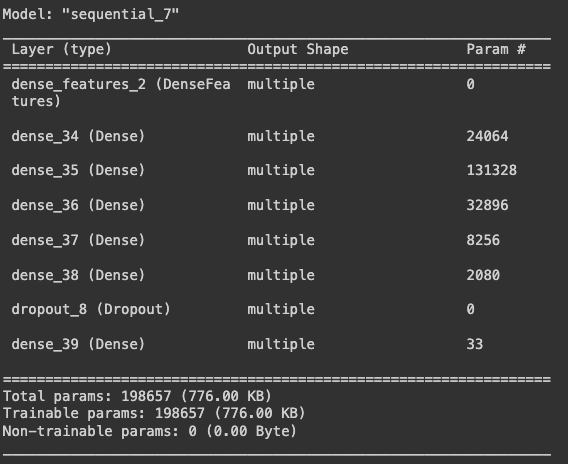

**Model Architecture:**

-   Model type: Sequential

-   Number of hidden layers: 11

    -   Layer 1 - Output shape: 512

    -   Layer 2 - Output shape: 512

    -   Layer 3 - Output shape: 256

    -   Layer 4 - Output shape: 256

    -   Layer 5 - Output shape: 128

    -   Layer 6 - Output shape: 128

    -   Layer 7 - Output shape: 64

    -   Layer 8 - Output shape: 64

    -   Layer 9 - Output shape: 32

    -   Layer 10 - Output shape: 32

    -   Layer 11 - Dropout

-   Optimiser: Adam

-   Learning rate: 0.001

-   Loss Function: MAE

-   Metrics: MAE, RMSE

-   Epoch: 50

**Preprocessing and Feature Engineering:**

-   Data Cleaning: Ensure dataset cleanliness and handle missing values.

-   Feature Selection: 3 categorical values (departure airport, arrival
    airport and cabin code) and other relevant numerical features are
    selected ('isBasicEconomy', 'isRefundable', 'isNonStop',
    'flightDepartureHour', 'flightDepartureMinute', 'flightDate\_month',
    'flightDate\_Day', 'flightDate\_DayofWeek')

-   Feature Encoding: Using Tensorflow one-hot encoding to convert
    categorical columns to numerical representation

-   Train-Test Split: Split data for model evaluation \[Train 64%,
    Validation 16%, Test 20%\].

**Model Evaluation:** Assess performance using regression metrics (e.g.,
MAE and RMSE).

Model 4 employs deep neural network using Tensorflow, and Keras to
iteratively improve the prediction of expected flight fares by boosting
the performance of a base decision tree regressor.

## **TensorFlow Keras (Michael)**

Neural network can be beneficial and useful to predict average flight
fare prices due to its ability to handle large amounts of data,
recognize complex patterns and automate feature engineering.

**Preprocessing:**

-   Transforming flight date into month, day, day of week, hour and
    minute

-   Splitting dataset by stratifying using unique pairs of departure and
    arrival airport, to ensure every pair of departure and arrival
    airports are present and equally distributed in training and testing
    datasets

-   Numerical columns scaling

-   Categorical columns embedding

**Key Hyperparameters/architecture:**

-   Number of neurons

-   DenseFeatures

-   Number of hidden layers

-   Number of epochs

-   Dropout layer

-   L1 & L2 regularizers

-   Keras optimizer

-   EarlyStopping

**Model Evaluation:** RMSE

Neural network offers many advantages but it is important to consider
the downsides such as overfitting. The aim is to train a neural network
architecture that can learn accurately by employing enough neurons and
hidden layers to detect patterns and stops when the model has seen and
learn enough to be able to generalize and not overfit.

## **TensorFlow Keras (Monali)**

Utilizing Tensorflow and Keras, deep learning tools based on neural
networks as they excel at capturing complex non-linear relationships,
and patterns, and adapting to dynamic data changes.

**Preprocessing:**

-   Selected relevant features and generated additional ones based on
    the departure date.

<!-- -->

-   Transformed Boolean features to string.

-   The dataset is divided into training (60%), validation (20%), and
    testing (20%) sets, followed by transformation into TensorFlow
    datasets.

-   Performed TensorFlow transformations for both numerical and
    categorical features.

**Tensorflow Architecture:**

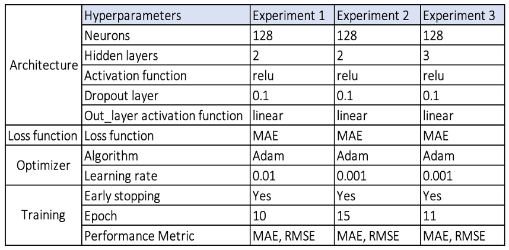

# Evaluation

## **Evaluation Metrics**

RMSE (Root Mean Squared Error): a common regression metric, measures the
square root of the average squared differences between predicted and
actual values. It's essential for these reasons:

-   Project Alignment: It aligns with the project's core objective of
    precise airfare estimation.

-   Outlier Sensitivity: RMSE detects the impact of outliers on
    predictions, crucial for extreme cases.

-   User-Friendly: RMSE's unit (USD) makes it user-friendly, allowing
    easy error interpretation.

MAE (Mean Absolute Error): calculates the average of absolute
differences between predicted and actual values. Its advantages include:

-   Robustness: MAE is robust to outliers, making it valuable when
    extreme values are present.

-   User Interpretation: MAE's USD unit offers user-friendly
    interpretation.

-   Project Goal Consistency: MAE aligns with the project's objective of
    accurate airfare estimates.

Metric Selection:

Using RMSE and MAE offers a comprehensive performance assessment. RMSE
gauges overall accuracy and outlier sensitivity, while MAE provides
insights into the average prediction error magnitude. These metrics
collectively ensure models provide accurate fare estimates, are robust
to extreme cases, and meet user and professional needs.

## **Result and Analysis**

The evaluation metrics RMSE and MAE for the training and validation
datasets are as follows:

### **Model 1: AdaboostRegressor (Tyler)**

RMSE and MAE metrics across the training, validation, and testing
datasets are consistent:

<table>
<colgroup>
<col style="width: 33%" />
<col style="width: 33%" />
<col style="width: 33%" />
</colgroup>
<tbody>
<tr>
<td style="text-align: left;"></td>
<td style="text-align: left;">RMSE</td>
<td style="text-align: left;">MAE</td>
</tr>
<tr>
<td style="text-align: left;">Training</td>
<td style="text-align: left;">224.094</td>
<td style="text-align: left;">157</td>
</tr>
<tr>
<td style="text-align: left;">Validation</td>
<td style="text-align: left;">224.481</td>
<td style="text-align: left;">157.066</td>
</tr>
<tr>
<td style="text-align: left;">Testing</td>
<td style="text-align: left;">224.16</td>
<td style="text-align: left;">156.967</td>
</tr>
</tbody>
</table>

-   Training and validation metrics align, indicating the model
    generalizes effectively.

-   Model performance remains stable across different datasets,
    showcasing its ability to make accurate airfare estimates in
    real-world scenarios.

-   While the models partially meet the project's goals, there is room
    for improvement. Further fine-tuning, exploring alternative
    algorithms, and feature engineering may enhance precision.

### **Model 2: Tensorflow Keras (Charles)**

Training loss, and validation loss improves drastically at the
beginning, and the loss rate gets slower as the epochs goes. Both losses
are consistent with training loss improvement smoother than validation
as expected.

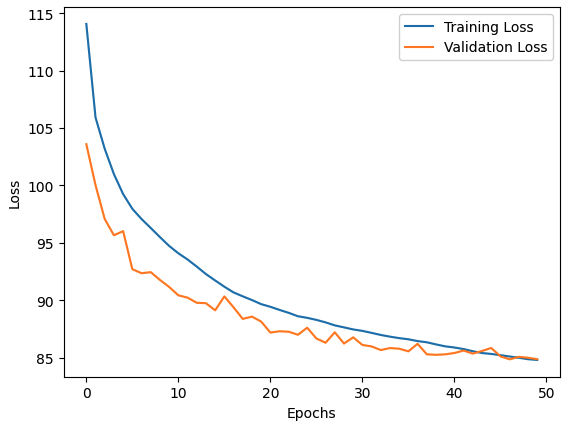

The behaviour of the improvement can also be seen in MAE, and RMSE for
both Training, and Validation set.

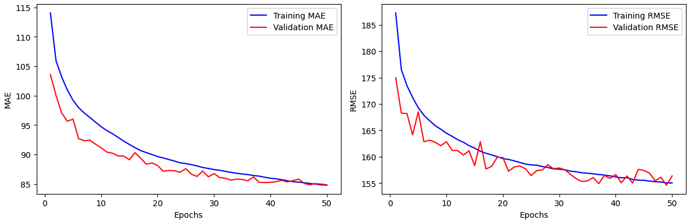

RMSE and MAE metrics across the training, validation, and testing
datasets are comparable:

<table>
<colgroup>
<col style="width: 33%" />
<col style="width: 33%" />
<col style="width: 33%" />
</colgroup>
<tbody>
<tr>
<td style="text-align: left;"></td>
<td style="text-align: left;">RMSE</td>
<td style="text-align: left;">MAE</td>
</tr>
<tr>
<td style="text-align: left;">Training</td>
<td style="text-align: left;">155.0372</td>
<td style="text-align: left;">84.7970</td>
</tr>
<tr>
<td style="text-align: left;">Validation</td>
<td style="text-align: left;">156.3654</td>
<td style="text-align: left;">84.8590</td>
</tr>
<tr>
<td style="text-align: left;">Testing</td>
<td style="text-align: left;">155.3763</td>
<td style="text-align: left;">84.3071</td>
</tr>
</tbody>
</table>

-   Training and validation metrics align, indicating the model
    generalizes effectively.

-   The testing metrics are comparable with both training, and
    validation which indicates the model is not overfitting.

-   Model performance remains stable across different datasets,
    showcasing its ability to make accurate airfare estimates in
    real-world scenarios.

-   We have experimented with a reduced hidden layers, ie. a shallow
    network with various configuration of hidden layers, and as expected
    the performance aren't as good. However, we did try adding one extra
    layer for each output types (ie. one more 512 layer, 256 layer,
    etc.) making it a 16 layer networks and the result is not as good as
    the 11 layers network.

-   Moreover, we also tried AdamW as our optimiser with the same 11
    layer networks but it does not beat the best model with Adam as
    optimiser.

In conclusion, the project has made promising progress in developing
airfare estimation models with consistent performance. Further
optimization can address residual errors and align more closely with
project objectives.

### **Model 3: Tensorflow Keras (Michael)**

Training result based on RMSE:

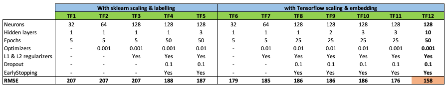

Our top performing model (TF 12) was able to perform 36% better than the
baseline model (RMSE: 158 vs 249). This experiment shows Deep learning’s
ability to recognize and learn from complex patterns. The web
application will be able to benefit from this model’s prediction
ability. Takeaways:

-   Scaling numerical and embedding categorical features using
    Tensorflow yields better results than scaling and labeling using
    sklearn. Model TF1 vs TF6, both have identical hyperparameters but
    TF6 (scaled with Tensorflow) performed 14% better than TF1.

-   Tuning optimizers from 0.01 to 0.001 yields better RMSE by allowing
    the model slowly and minimizing overshooting the optimal loss point;
    by plotting the learning process between the two optimizer values,
    we can see 0.001 optimizer allow the model to find loss point more
    smoothly:

> **Optimizer: 0.01**
>
> 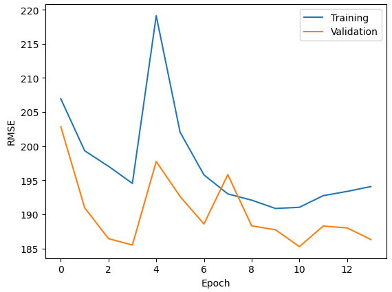 style="width:3.99792in;height:2.9809in" />
>
> **Optimizer: 0.001**

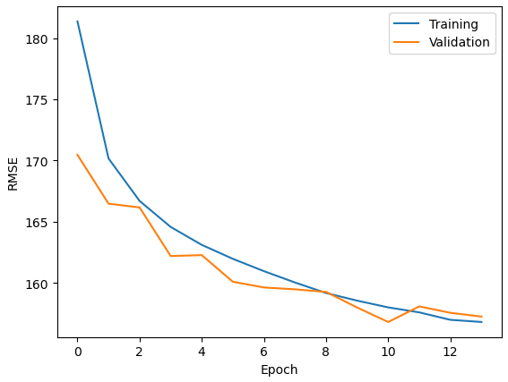

-   Adding more neurons and layers does allow the model to perform
    better up to a certain point where EarlyStopping kicks in when it
    stops getting better

-   Adding more neurons, layers and lowering the optimizer value
    significantly increases the computation time and power. We should
    weigh the cost and benefits of adding more complexity and time/power
    in future experiments.

### **Model 4: Tensorflow Keras (Monali)**

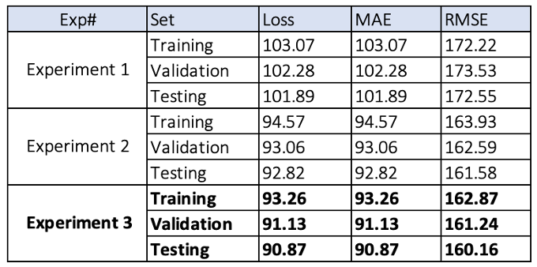

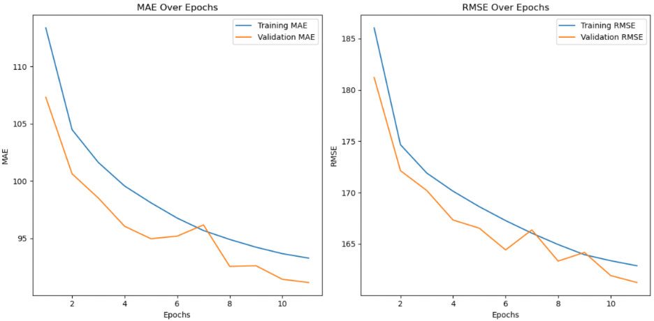

-   The model from Experiment 3 performs well based on the above
    metrics. The decreasing trends in MAE, and RMSE across training,
    validation, and test sets suggest effective learning and
    generalization. The lower values of test metrics indicate the
    model's ability to make accurate predictions on unseen data.

-   Reference to EarlyStopping in the insights suggests that models are
    designed to stop training when they cease to improve. This prevents
    overfitting and improves generalization.

-   Experiment 3 uses an optimizer value of 0.001 as the learning rate,
    and it results in better performance, indicating that the magnitude
    of adjustments made to the model’s weight during the training
    process has a positive impact on model training. Thus, it helped the
    model acquire knowledge from the data and the ability to generalize
    effectively.

-   The project benefits from the ability of deep learning models to
    capture complex patterns, as demonstrated by the performance
    improvements across experiments. Further analysis, such as feature
    importance, exploration of data patterns, and experimenting with
    hyperparameters and model architecture could be performed to enhance
    the model's performance.

## **Impacts and Benefits**

The final model for airfare estimation holds significant promise in
addressing various business use cases within the travel and
transportation industry. Here's an assessment of its impact and
benefits:

**1. Travel Planning Websites and Apps:**

-   Impact: Users can estimate airfare costs accurately when browsing
    for destinations and itineraries, enhancing their travel planning
    experience.

-   Benefits: The final model contributes to more informed
    decision-making for travelers, potentially leading to higher booking
    rates and user satisfaction.

**2. Travel Agencies and Tour Operators:**

-   Impact: Travel professionals can provide quick and accurate fare
    estimates when designing customized travel packages.

-   Benefits: Improved pricing information enables travel agencies to
    offer competitive packages, attracting more clients and enhancing
    their reputation.

## **Data Privacy and Ethical Concerns**

The project involves data collection, usage, and model deployment, which
raises several data privacy and ethical concerns. Following is an
assessment of these implications and the steps taken to address them:

**Data Privacy:** The dataset may contain sensitive information about
travelers, such as travel itineraries and pricing details. Unauthorized
access to or misuse of this data could lead to privacy violations and
potential harm to individuals.

**Bias and Fairness:** Models may unintentionally incorporate bias,
leading to unfair treatment or pricing discrimination.

**Transparency:** Lack of model transparency may raise concerns about
how predictions are made and whether they are fair and unbiased.

# Deployment

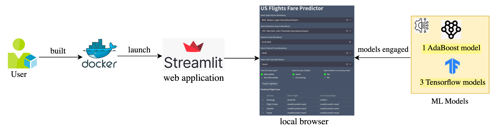

## Model Serving

**The process of deploying the trained models:** Deploying a trained
machine learning model involves making the model available for use in a
production environment so that it can generate predictions on new data.
Following steps are performed for this purpose.

1\. Prepare Model for Deployment: Once the model is trained and
evaluated for desired prediction result, the models are saved as
separate files for later integration.

2\. Streamlit Application Development:

-   Created a Streamlit application that collects the user input with
    user-friendly interface for fare prediction.

-   Implemented input validation and integrated trained models into the
    application.

-   Implemented input processing and with the four models, provided fare
    predictions in a table.

3\. Choose a Deployment Platform:

-   Streamlit: Used streamlit to deploy our model as a web application
    service for end users to use.

-   Containerization: Built Docker image and containers that packages
    machine learning models and their dependencies.

4.. Documentation: With this report documenting the process to help
other developers and users understand how to use it.

**Challenges for deployment:**

It was difficult to maintain consistent environment setups and package
versions among team members for validating model predictions on the
Streamlit application. To address this issue, we implemented a Docker
image and containerization, providing a streamlined and reproducible
solution for a uniform deployment environment across the team.

**Purpose of the Application:**

The purpose of this application is to provide users in the USA with a
tool to estimate the airfare for local travel. Users can input details
of their trip, including the origin and destination airports, departure
date, departure time, and cabin type.

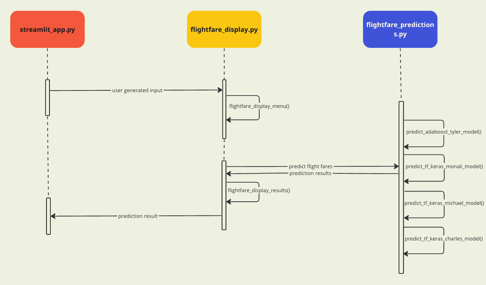

**The Main functionalities and Key features**:

1.  Input Collection: Users need to provide trip details, such as the
    airport of departure, destination, travel date, departure time, and
    cabin type and (optional whether ticket should be refundable and
    basic-economy)

2.  Validation and Input store: Validate if the user has provided all
    the mandatory information in their inputs before getting fare
    predictions to ensure the correctness of the provided information.
    Additionally, store the input values into session state variables.

3.  Model Integration: The application integrates four different machine
    learning models, each trained by a different student. When users
    click a "Predict Fare" button, the application calls these models to
    predict the expected flight fare based on the user's inputs.

4.  Display Predictions: The application displays fare predictions from
    each of the four models, offering users multiple predictions for
    better decision-making.

**Instructions to Set Up and Launch the Web Application:**

-   To set up environment for the web application, follow below steps:

1.  Install Python and Docker on your system if not already installed.

2.  Create a new local directory and clone the streamlit git repository
    using:

> “git clone
> [<u>git@github.com</u>](mailto:git@github.com):tyler737/adv\_mla\_at3\_steamlit.git”

-   To launch the web application, follow these steps:

1.  From the CLI execute: “docker compose up”

2.  Ensure the docker image is built followed by container launch
    successfully.

3.  From local browser launch streamlit web app using URL:
    http://localhost:8502

4.  Enter the necessary flight details and click to receive fare
    predictions.

5.  To terminate the web application, execute “docker compose down”

# Collaboration

## **Team Interaction and Communication**

-   **Regular Meetings:** We made it a point to have regular virtual
    meetings. These sessions were invaluable for discussing project
    progress, tackling challenges, and making collective decisions.

-   **Clear Roles and Responsibilities:** To maintain focus and clarity,
    we defined specific roles and responsibilities for each team member.
    This structure ensured that everyone had a well-defined purpose.

-   **Communication channel:** In addition to formal meetings, our
    WhatsApp group and Teams became our go-to space for quick updates,
    casual discussions, and urgent communication.

-   **Github:** We utilize Github and cookie cutter template to manage
    our project and version control.

-   **Roles and Responsibility:** Below table shows how we divide tasks
    for our individual contribution:

<table>
<colgroup>
<col style="width: 62%" />
<col style="width: 37%" />
</colgroup>
<thead>
<tr>
<th><strong>Tasks</strong></th>
<th><strong>Designated Team Member</strong></th>
</tr>
</thead>
<tbody>
<tr>
<td>Exploratory Data Analysis</td>
<td>Monali and Tyler</td>
</tr>
<tr>
<td>Data Preprocessing</td>
<td>Charles and Michael</td>
</tr>
<tr>
<td>Model Training and Evaluation</td>
<td>All</td>
</tr>
<tr>
<td>Streamlit App Creation and Input Validation</td>
<td>Monali</td>
</tr>
<tr>
<td>Streamlit Functions</td>
<td>Monali, Charles &amp; Michael</td>
</tr>
<tr>
<td>Report Writing</td>
<td>All</td>
</tr>
</tbody>
</table>

-   

## **Issues Faced**

During the initial project stages, our team faced Python environment,
package discrepancies, and data wrangling challenges due to the complex
dataset. Here's how we tackled them and key takeaways for future
collaborations:

1.  Package Discrepancy Issues:

-   Challenge: Package version discrepancies could disrupt code
    execution and model reproducibility.

-   Resolution: Managed package versions using Docker

1.  Data Wrangling Challenges:

-   Challenge: Cleaning and preprocessing the extensive dataset with
    missing values and outliers was a demanding task.

-   Resolution: Collaboratively designed a data preprocessing plan,
    assigned specific tasks, and documented processes. Utilized pandas
    for data wrangling.

**Lessons Learned:**

-   Emphasized clear communication, providing updates on Python
    environments, packages, and data preprocessing to prevent issues or
    utilize Docker to manage dependencies.

-   Documented data preprocessing comprehensively for team understanding
    and future reference.

-   Leveraged collaboration tools like GitHub for version control and
    issue tracking.

# Conclusion

The developed application serves as a valuable tool for users in the
USA, enabling them to estimate airfare costs and make informed travel
decisions. It streamlines travel planning, enhances user experience, and
offers efficiency to travel professionals. However, it's important to
acknowledge limitations related to data quality and dynamic pricing. The
application's potential benefits extend to a wide range of users,
including individual travelers, travel agencies, corporate travel
planners, and budget-conscious travelers. By addressing these
limitations and maintaining data accuracy, the application can further
optimize its utility in the travel and transportation industry.

# References

1.  ING. (2023, July 10). *Global aviation outlook: Air fares climb
    higher amid the unprecedented recovery of travel*

> [<u>https://www.ing.com/Newsroom/News/Global-aviation-outlook-Air-fares-climb-higher-amid-the-unprecedented-recovery-of-travel.htm#:~:text=US%20airline%20tickets%20were%20more,%25%20of%20total%20operational%20costs</u>](https://www.ing.com/Newsroom/News/Global-aviation-outlook-Air-fares-climb-higher-amid-the-unprecedented-recovery-of-travel.htm#:~:text=US%20airline%20tickets%20were%20more,%25%20of%20total%20operational%20costs)).

1.  Stalnaker, T., Usman, K., Alport, G., Buchanan, A. (2023). *AIRLINE
    ECONOMIC ANALYSIS 2022-2023.*

> https://www.oliverwyman.com/our-expertise/insights/2023/may/airline-economic-analysis-2022-2023.html

